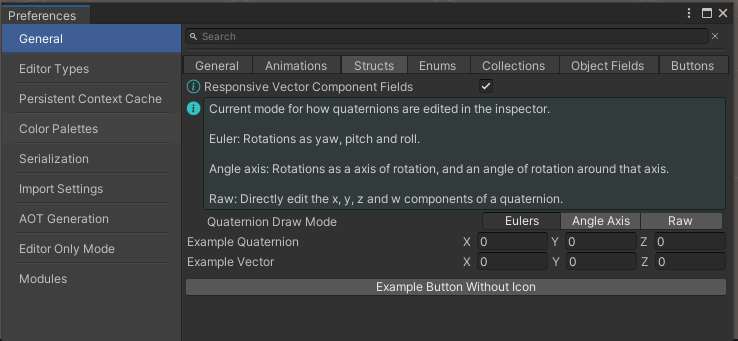
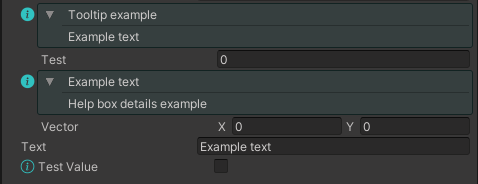

# OdinHelpBox
Set of scripts that change how tooltips are drawn when using Odin Inspector and add new attribute for drawing compact help boxes.

When folded, the tooltip is displayed by hovering over a toggle button.

If you don't want to change how tooltips are drawn, remove `TooltipDetailsAttribute.cs` and `HelpBoxTooltipDrawer.cs`.

If you don't want HelpBox attribute, remove `HelpBoxAttribute.cs` and `HelpBoxAttributeDrawer.cs`.

To add details to tooltip, add `TooltipDetails` attribute.



## Example usage



```cs
[Tooltip("Tooltip example")]
[TooltipDetails("@" + nameof(m_text))]
[SerializeField] private float m_test;

[PropertyTooltip("@" + nameof(m_text))]
[ShowInInspector]
private bool TestValue { get; set; }

[HelpBox("@" + nameof(m_text), "Help box details example")]
[SerializeField] private Vector2 m_vector;

[SerializeField] private string m_text = "Example text";
```
